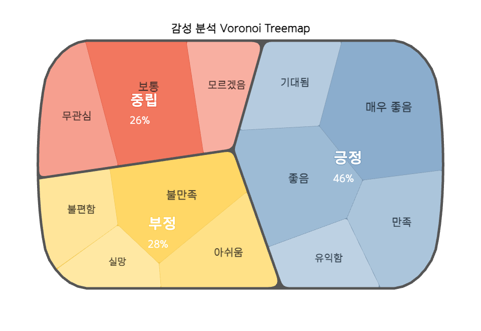

# Voronoi Treemap Library - Distribution Files

Interactive Voronoi treemap visualization library converted from Observable notebook.



*pebbleRound: 20, pebbleWidth: 5*

## CDN Usage (jsdelivr)

### ES Module (Recommended)

```javascript
import VoronoiTreemap from 'https://cdn.jsdelivr.net/gh/pxd-uxtech/voronoi-treemap-dist@v1.1.0/dist/voronoi-treemap.esm.js';

const treemap = new VoronoiTreemap();
const svg = treemap.render(data, options);
```

### UMD Bundle

```html
<script src="https://cdn.jsdelivr.net/npm/d3@7"></script>
<script src="https://cdn.jsdelivr.net/npm/d3-weighted-voronoi@1"></script>
<script src="https://cdn.jsdelivr.net/npm/d3-voronoi-map@2"></script>
<script src="https://cdn.jsdelivr.net/npm/d3-voronoi-treemap@1"></script>
<script src="https://cdn.jsdelivr.net/npm/seedrandom@3"></script>
<script src="https://cdn.jsdelivr.net/gh/pxd-uxtech/voronoi-treemap-dist@v1.1.0/dist/voronoi-treemap.umd.js"></script>

<script>
  const treemap = new VoronoiTreemap.VoronoiTreemap();
  const svg = treemap.render(data, options);
</script>
```

### Minified Version

```html
<script src="https://cdn.jsdelivr.net/gh/pxd-uxtech/voronoi-treemap-dist@v1.1.0/dist/voronoi-treemap.min.js"></script>
```

## Observable Usage

### Recommended: Standalone Bundle - 760KB

For Observable notebooks, use the standalone bundle that includes all dependencies. While larger in file size, it's the simplest and most reliable option for Observable's module system.

```javascript
// Cell 1: Import library with popup helpers
{
  const module = await import("https://cdn.jsdelivr.net/gh/pxd-uxtech/voronoi-treemap-dist@v1.1.0/dist/voronoi-treemap.standalone.js");
  VoronoiTreemap = module.VoronoiTreemap;
  showVoronoiPopup = module.showVoronoiPopup;  // Import popup helper from library
  return module;
}
```

```javascript
// Cell 2: Create visualization with popup
chart = {
  const data = [
    { metaLabel: "A", label: "Item 1", bubbleSize: "100" },
    { metaLabel: "A", label: "Item 2", bubbleSize: "80" },
    { metaLabel: "B", label: "Item 3", bubbleSize: "120" }
  ];

  const treemap = new VoronoiTreemap();

  return treemap.render(data, {
    width: 900,
    height: 600,
    maptitle: 'My Treemap',
    metaLabelPositions: 'auto',
    showMetaLabel: true,
    showLabel: true,
    showPercent: true,
    pebble: true,
    pebbleRound: 5,
    pebbleWidth: 2,
    clickFunc: showVoronoiPopup  // Use the imported popup helper
  });
}
```

**Note**: The standalone bundle (760KB) includes all D3 dependencies bundled together. Observable caches imported modules efficiently, so the file is only loaded once per notebook session.

### Local HTML File Usage (UMD Standalone)

For local HTML files that you can double-click to open (using `file://` protocol), use the UMD standalone bundle:

```html
<!DOCTYPE html>
<html>
<head>
  <meta charset="utf-8">
  <title>Voronoi Treemap - Local Example</title>
</head>
<body>
  <div id="chart"></div>

  <!-- Load UMD bundle - works with file:// protocol -->
  <script src="https://cdn.jsdelivr.net/gh/pxd-uxtech/voronoi-treemap-dist@v1.1.0/dist/voronoi-treemap.standalone.umd.js"></script>

  <script>
    // Access library from global variable
    const { VoronoiTreemap, showVoronoiPopup } = VoronoiTreemapModule;

    const data = [
      { metaLabel: "A", label: "Item 1", bubbleSize: "100" },
      { metaLabel: "A", label: "Item 2", bubbleSize: "80" },
      { metaLabel: "B", label: "Item 3", bubbleSize: "120" }
    ];

    const treemap = new VoronoiTreemap();
    const svg = treemap.render(data, {
      width: 900,
      height: 600,
      maptitle: 'My Treemap',
      clickFunc: showVoronoiPopup
    });

    document.getElementById('chart').appendChild(svg);
  </script>
</body>
</html>
```

**Why UMD for local files?**
- ES Modules (`import` statements) are blocked by CORS when using `file://` protocol
- UMD bundles work with `<script>` tags and expose global variables
- No web server required - just double-click the HTML file to open

## Data Format

```javascript
[
  {
    metaLabel: "Region Name",  // metaLabel - Top-level grouping
    label: "Cluster Name",     // label - Label for this item
    text: "Sub Item Name",     // text - Sub-level label (optional)
    bubbleSize: 100            // Size value (number; string also accepted)
  }
]
```

## Configuration Options

```javascript
{
  width: 900,                   // Canvas width
  height: 600,                  // Canvas height
  maptitle: 'Title',            // Main title
  mapcaption: 'Caption',        // Subtitle
  metaLabelPositions: 'auto',   // Cell position control: 'auto' or array of {key, depth, x, y}
  showMetaLabel: true,          // Show metaLabel labels
  showLabel: true,              // Show label labels
  showPercent: true,            // Show percentage labels
  pebble: true,                 // Enable pebble rendering
  pebbleRound: 5,               // Corner rounding
  pebbleWidth: 2,               // Pebble stroke width
  clickFunc: function(d) {      // Click handler (receives {data, event})
    console.log('Clicked:', d);
  },
  getCellColors: function(cellColors) { // Callback to receive actual cell colors
    console.log('Cell colors:', cellColors);
    // cellColors: [{metaLabel: "Region A", metaColor: "#afc7dd", label: "Sub Item", color: "#a5c0d9"}, ...]
  },
  colors: [                     // Custom color palette (optional)
    "#FF6B6B",                  // Color for largest metaLabel
    "#4ECDC4",                  // Color for 2nd largest metaLabel
    "#45B7D1"                   // Color for 3rd largest metaLabel
  ],
  metaLabelColors: [            // Override colors for specific metaLabels (optional)
    { key: "긍정", color: "#4CAF50" },
    { key: "부정", color: "#F44336" }
  ]
}
```

## Custom Label Renderers

Use `metaLabelRenderer` and `labelRenderer` to fully customize label appearance by returning an HTML string from a function.

### `metaLabelRenderer`

Customizes labels for the top-level group (metaLabel).

```javascript
metaLabelRenderer: (d, defaultHtml, ctx) => {
  // d           - data node
  // defaultHtml - default HTML string
  // ctx         - context object:
  //   ctx.key         - metaLabel name
  //   ctx.fontSize    - computed font size (em base value)
  //   ctx.darkerColor - a darker shade of the region color (for outlines/strokes)
  //   ctx.percentText - percentage string (e.g. "34.5%")

  return `<div>...</div>`;  // return custom HTML
  // return "" to hide the label
  // return defaultHtml to keep default rendering
}
```

### Example: Non-overlapping percent display

Uses `-webkit-text-stroke` to render a colored outline behind text, keeping labels readable over complex backgrounds. Auto-generated keys like "cluster 1" are hidden.

```javascript
treemap.render(data, {
  showMetaLabel: true,
  showPercent: true,
  metaLabelRenderer: (d, defaultHtml, ctx) => {
    const keyStr = String(ctx.key ?? "");

    // Hide numeric or "cluster N" keys
    if (/^\d+$/.test(keyStr) || /^cluster\s*\d+$/i.test(keyStr)) {
      return "";
    }

    return `
      <div style="text-align:center; color:#fff;">
        <div style="
          font-weight: 600;
          font-size: ${ctx.fontSize * 0.95}em;
          line-height: 1.1;
          color: #fff;
          white-space: nowrap;
          -webkit-text-stroke: 3px ${ctx.darkerColor};
          paint-order: stroke fill;
        ">
          ${ctx.key}<br>
          <small style="
            font-size: 80%;
            -webkit-text-stroke: 1px ${ctx.darkerColor};
          ">${ctx.percentText}</small>
        </div>
      </div>`;
  }
});
```

**Key points:**
- `paint-order: stroke fill` — draws the outline before the fill so it doesn't eat into the text
- `-webkit-text-stroke` — uses the region's darker color as an outline for contrast
- `ctx.darkerColor` — automatically calculated by the library; no need to specify manually
- `return ""` — hides the label for small or unlabeled regions

### `labelRenderer`

Customizes labels for the second level (label) in the same way.

```javascript
treemap.render(data, {
  labelRenderer: (d, defaultHtml, ctx) => {
    // ctx.key, ctx.fontSize, ctx.darkerColor, ctx.percentText work identically
    return `<div style="color:#fff;">${ctx.key}</div>`;
  }
});
```

## Cell Position Control

Use `metaLabelPositions` to control where regions appear in the chart. By default (`'auto'`), the library places them automatically.

### Manual positioning

Pass an array of `{ key, depth, x, y }` objects. Coordinates are arbitrary — the library normalizes them to fit the chart. Only `depth: 1` (metaLabel) entries are required; `depth: 2` (label) and `depth: 3` (text) are optional for finer control.

```javascript
treemap.render(data, {
  metaLabelPositions: [
    { key: '긍정', depth: 1, x: 700, y: 200 },  // right side
    { key: '중립', depth: 1, x: 400, y: 300 },  // center
    { key: '부정', depth: 1, x: 100, y: 400 }   // left side
  ]
});
```

**Field reference:**
- `key` — the `metaLabel`, `label`, or `text` value from your data
- `depth` — hierarchy level: `1` = metaLabel, `2` = label, `3` = text
- `x`, `y` — position hint (any scale; normalized to 0.15–0.85 range automatically)

### Quadrant layout example

```javascript
treemap.render(data, {
  metaLabelPositions: [
    { key: 'A', depth: 1, x: 0, y: 0 },   // top-left
    { key: 'B', depth: 1, x: 1, y: 0 },   // top-right
    { key: 'C', depth: 1, x: 0, y: 1 },   // bottom-left
    { key: 'D', depth: 1, x: 1, y: 1 }    // bottom-right
  ]
});
```

### Circular layout example

```javascript
const cx = 400, cy = 300, r = 200;
const n = 5;

treemap.render(data, {
  metaLabelPositions: Array.from({ length: n }, (_, i) => ({
    key: categories[i],
    depth: 1,
    x: cx + Math.cos((2 * Math.PI * i) / n) * r,
    y: cy + Math.sin((2 * Math.PI * i) / n) * r
  }))
});
```

> **Note:** Position hints guide the voronoi algorithm's initial state — the final layout is determined by cell sizes. Larger cells will expand to fill their allotted area, so exact pixel placement is not guaranteed.

## Color Assignment

Colors are automatically assigned to regions based on their total `bubbleSize`, from largest to smallest.

### Using Custom Color Palette

Provide a `colors` array to use custom colors. The largest region receives the first color, second largest receives the second color, and so on.

```javascript
const treemap = new VoronoiTreemap();
treemap.render(data, {
  colors: [
    "#FF6B6B",  // Largest region gets this color
    "#4ECDC4",  // 2nd largest region gets this color
    "#45B7D1",  // 3rd largest region gets this color
    "#FFA07A",
    "#98D8C8"
  ]
});
```

**Important**: Colors are assigned by size order, NOT by data order. If your data has regions in order [A, B, C] but their sizes are C > A > B, then:
- Region C (largest) → first color `#FF6B6B`
- Region A (2nd) → second color `#4ECDC4`
- Region B (3rd) → third color `#45B7D1`

### Using metaLabel-Specific Colors

Use `metaLabelColors` to override colors for specific metaLabels by name:

```javascript
treemap.render(data, {
  metaLabelColors: [
    { key: "긍정", color: "#4CAF50" },  // Green for "긍정" metaLabel
    { key: "부정", color: "#F44336" },  // Red for "부정" metaLabel
    { key: "중립", color: "#FFC107" }   // Yellow for "중립" metaLabel
  ]
});
```

### Getting Applied Colors

Use `getCellColors` to see which colors were actually applied:

```javascript
let appliedColors = [];

treemap.render(data, {
  colors: ["#FF6B6B", "#4ECDC4", "#45B7D1"],
  getCellColors: (cellColors) => {
    appliedColors = cellColors;
    console.log('Applied colors:', cellColors);
    // Example output:
    // [
    //   {metaLabel: "긍정", metaColor: "#FF6B6B", label: "매우 좋음", color: "#ff8989"},
    //   {metaLabel: "긍정", metaColor: "#FF6B6B", label: "좋음", color: "#ff9898"},
    //   {metaLabel: "중립", metaColor: "#4ECDC4", label: "보통", color: "#5dd9d0"},
    //   ...
    // ]
  }
});
```

## Popup Helper Functions

The library includes built-in popup helper functions that you can use with `clickFunc`:

### `showVoronoiPopup(clickedData)`

Default popup function for Observable notebooks. Returns an HTML element using Observable's `html` template literal.

```javascript
// Observable usage
import { VoronoiTreemap, showVoronoiPopup } from "..."

const treemap = new VoronoiTreemap();
treemap.render(data, {
  clickFunc: showVoronoiPopup
});
```

### `createDOMPopup(clickedData)`

DOM-based popup for standard web pages. Creates an absolutely positioned popup at the click location.

```javascript
// Standard HTML/JavaScript usage
import { VoronoiTreemap, createDOMPopup } from "..."

const treemap = new VoronoiTreemap();
treemap.render(data, {
  clickFunc: createDOMPopup
});
```

### `getPopupStyles()`

Returns CSS styles for the popup elements as a string.

```javascript
// Observable
html`<style>${getPopupStyles()}</style>`

// Standard HTML
const style = document.createElement('style');
style.textContent = getPopupStyles();
document.head.appendChild(style);
```

### `getBubbleStyles()`

Returns comprehensive CSS styles for bubble/voronoi visualizations including fonts, regions, areas, labels, and popups.

```javascript
// Observable
html`<style>${getBubbleStyles()}</style>`

// Standard HTML
const style = document.createElement('style');
style.textContent = getBubbleStyles();
document.head.appendChild(style);
```

This includes:
- KoddiUD OnGothic font faces (Regular & Bold)
- `.region`, `.metaLabelArea`, `.labelArea`, `.textArea` styles
- `.label-item`, `.text-item`, `.percent-label` label styles
- Highlight and click states (`.highlite`, `.clicked`)
- Popup styles (`.voronoi-popup-content`, `.voronoi-popup-message`)

## Getting Cell Colors

Use `getCellColors` callback to retrieve actual cell colors after rendering. Useful for creating legends or syncing with Observable mutable variables.

### Observable Usage with Mutable

```javascript
// Cell 1: Declare mutable variable
mutable cellColors = []
```

```javascript
// Cell 2: Render chart and capture colors
{
  const treemap = new VoronoiTreemap();
  const svg = treemap.render(data, {
    width: 800,
    height: 600,
    getCellColors: (colors) => {
      mutable cellColors = colors;
    }
  });

  return svg;
}
```

```javascript
// Cell 3: Use cellColors in another cell (e.g., create legend)
{
  // De-duplicate by metaLabel to get one entry per top-level group
  const seen = new Set();
  const legend = cellColors
    .filter(c => {
      if (seen.has(c.metaLabel)) return false;
      seen.add(c.metaLabel);
      return true;
    })
    .map(c => html`
      <div style="display: flex; align-items: center; gap: 8px; margin: 5px 0;">
        <div style="width: 30px; height: 20px; background: ${c.metaColor}; border: 1px solid #ccc;"></div>
        <span>${c.metaLabel}</span>
      </div>
    `);

  return html`<div>${legend}</div>`;
}
```

### Standard JavaScript Usage

```javascript
let cellColors = [];

const treemap = new VoronoiTreemap();
treemap.render(data, {
  width: 800,
  height: 600,
  getCellColors: (colors) => {
    cellColors = colors;
    console.log('Cell colors:', colors);
    // colors: [{metaLabel: "Region A", metaColor: "#afc7dd", label: "Sub Item", color: "#a5c0d9"}, ...]
  }
});

// Create legend - de-duplicate by metaLabel
const seen = new Set();
const legendHTML = cellColors
  .filter(c => {
    if (seen.has(c.metaLabel)) return false;
    seen.add(c.metaLabel);
    return true;
  })
  .map(c => `
    <div style="display: flex; align-items: center; margin: 8px 0;">
      <div style="width: 40px; height: 25px; background: ${c.metaColor}; border: 2px solid #ddd;"></div>
      <span style="margin-left: 10px;">${c.metaLabel}</span>
    </div>
  `)
  .join('');

document.getElementById('legend').innerHTML = legendHTML;
```

### Returned Data Format

Each cell object contains:
```javascript
{
  metaLabel: string,  // Top-level group name (depth 1=metaLabel, 2=label, 3=text)
  metaColor: string,  // Color of the top-level group (hex code)
  label: string,      // Item label
  color: string,      // Actual applied color for this item (hex code)

  // Legacy fields (still included for backward compatibility)
  bigLabel: string,   // Same as metaLabel
  bigColor: string    // Same as metaColor
}
```

## Recommended CSS

```css
@font-face {
  font-family: 'KoddiUD OnGothic';
  src: url('https://fastly.jsdelivr.net/gh/projectnoonnu/noonfonts_2105_2@1.0/KoddiUDOnGothic-Regular.woff') format('woff');
  font-weight: normal;
  font-style: normal;
}

.region {
  font-family: "KoddiUD OnGothic", sans-serif;
  fill: #fff;
  fill-opacity: 1;
  font-weight: 700;
}

.textArea.highlite {
  filter: hue-rotate(-5deg) brightness(0.95);
}

.textArea.clicked {
  stroke: #000;
  stroke-width: 3px;
  filter: brightness(0.9);
}
```

## Files

- `dist/voronoi-treemap.standalone.js` - Standalone ESM bundle with all dependencies (760KB) - **Use this for Observable**
- `dist/voronoi-treemap.standalone.umd.js` - Standalone UMD bundle with all dependencies (837KB) - **Use this for local HTML files**
- `dist/voronoi-treemap.esm.js` - ES Module bundle with external dependencies (68KB) - For npm/build tools
- `dist/voronoi-treemap.umd.js` - UMD bundle with external dependencies (74KB) - For browsers with script tags
- `dist/voronoi-treemap.min.js` - Minified UMD bundle (26KB) - For production
- Source maps included for all bundles

## Dependencies

The ESM and UMD bundles have peer dependencies (must be loaded separately):
- d3 (^7.0.0)
- d3-weighted-voronoi (^1.0.0)
- d3-voronoi-map (^2.0.0)
- d3-voronoi-treemap (^1.0.0)
- seedrandom (^3.0.0)

The standalone bundle includes all dependencies pre-bundled.

## Version History

### 1.2.0
- **Fixed SVG sizing**: `width` and `height` options now define the actual SVG output size. Previously the SVG was `width+100` × `height+100` due to internal margins, causing the chart to overflow and clip its container.
- **Renamed CSS classes** for clarity (breaking change — update any custom styles):
  - `regionArea1` → `metaLabelArea`
  - `regionArea2` → `labelArea`
  - `regionArea3` → `textArea`
  - `.field` → `.label-item`
  - `.sector` → `.text-item`
  - `.budget` → `.percent-label`
- **Added `metaLabelRenderer` and `labelRenderer` documentation** with HTML customization example

### 1.1.0
- **Renamed hierarchy fields** for clarity:
  - `region` → `metaLabel`
  - `bigClusterLabel` → `label`
  - `clusterLabel` → `text`
- **Renamed options** to match new field names:
  - `showRegion` → `showMetaLabel`
  - `regionPositions` → `metaLabelPositions`
  - `regionColors` → `metaLabelColors`
  - `regionLabelRenderer` → `metaLabelRenderer`
  - `bigClusterLabelRenderer` → `labelRenderer`
- **Updated `getCellColors` return format**: now includes `metaLabel`/`metaColor` fields (new) alongside `bigLabel`/`bigColor` (legacy)
- **Full backward compatibility**: old field names and option names continue to work

### Latest (2026-01-22)
- **Fixed region color assignment**: Colors now assigned by total bubbleSize (largest first), not data order
  - Previously: Colors assigned based on the order data appeared in the array
  - Now: Regions sorted by bubbleSize total, largest region gets first color from palette
  - Example: Region A (500) → #afc7dd, Region B (300) → #ffe9a9, Region C (200) → #f69f8f
- **Added `getCellColors` callback**: Retrieve actual cell colors after rendering
  - Returns array of `{depth, key, color}` objects for all rendered cells
  - Useful for creating legends or syncing with Observable mutable variables
  - Works perfectly with Observable's `mutable` variables

### 1.0.5 (2026-01-16)
- Added standalone UMD bundle (`voronoi-treemap.standalone.umd.js`)
- Enables local file usage without CORS restrictions
- Exposes `VoronoiTreemapModule` as global variable for `<script>` tag usage
- Perfect for double-click HTML files and local development

### 1.0.4 (2026-01-06)
- Added `getBubbleStyles()` for comprehensive bubble visualization CSS
- Includes Korean fonts, region/area styles, label styles, and popup styles

### 1.0.3 (2026-01-06)
- Added built-in popup helper functions
- `showVoronoiPopup()` - Observable-compatible popup
- `createDOMPopup()` - Standard DOM popup
- `getPopupStyles()` - Get popup CSS styles
- Export popup helpers from main module

### 1.0.2 (2026-01-06)
- Fixed CommonJS module compatibility for standalone bundle
- Improved seedrandom module handling

### 1.0.1 (2026-01-06)
- Added standalone bundle with all dependencies
- Fixed Observable module compatibility

### 1.0.0 (2026-01-06)
- Initial release
- Converted from Observable notebook to standalone ES module
- Includes ESM, UMD, and minified bundles
- Full TypeScript-style JSDoc documentation
- CSS selector escaping for special characters
- Interactive click and hover events

## Original Source

Original Observable notebook: [@taekie/voronoi-treemap-class](https://observablehq.com/@taekie/voronoi-treemap-class@338)

## License

ISC
